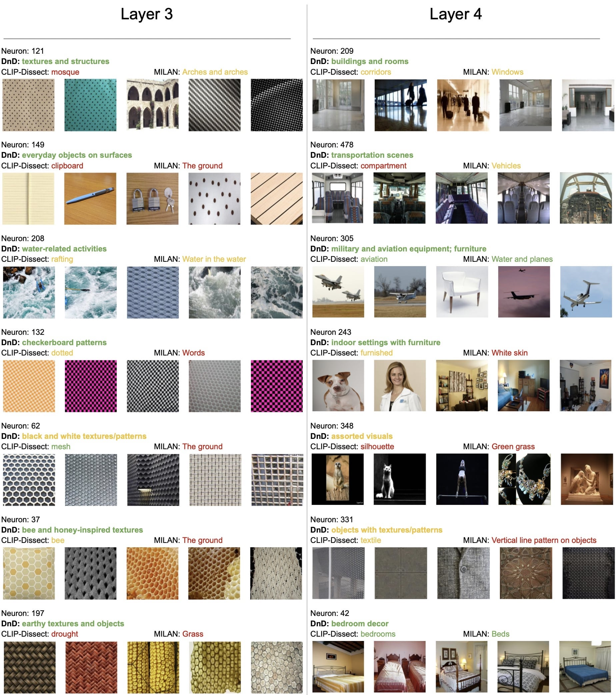

# DnD

Here we utilize DnD to provide some qualitative random neuron examples from two deep vision models. We also include labels from prior works to compare against our descriptions and color-code them by if we believe them to be accurate (green), somewhat correct (orange), or vague/imprecise (red).

## ViT-B/16

## ResNet-18

